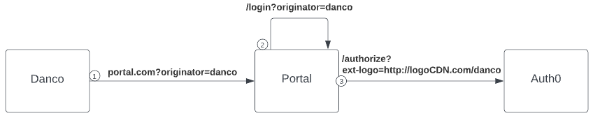
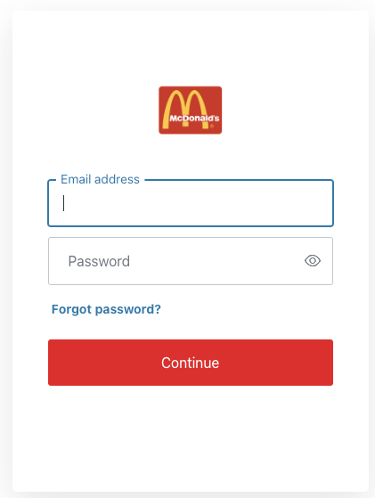
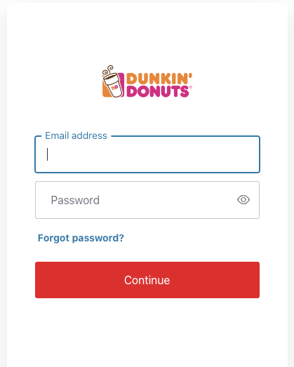

# Description  
This example is based on the [Auth0 quickstart](https://auth0.com/docs/quickstart/webapp/aspnet-core) and has been modified to pass a custom query parameter containing a logo URL in the redirect to [/authorize](https://auth0.com/docs/api/authentication#authorization-code-flow).  

## New Universal Login
The universal login (UL) script can be found [here](./Auth0/NewULScript.html). It has been modified to accept the `ext-logo` [custom query parameter](https://auth0.com/docs/customize/universal-login-pages/universal-login-page-templates#custom-query-parameters) and set it as the logo using [CSS customization](https://auth0.com/docs/customize/universal-login-pages/universal-login-page-templates#css-customization).  

The UL script can be updated via a PUT request to [/api/v2/branding/template/universal-login](https://auth0.com/docs/api/management/v2#!/Branding/put_universal_login).  

**Note:**  A [custom domain](https://auth0.com/docs/customize/custom-domains) is required before the updated template takes effect  

## Classic Universal Login (lock.js)
The classic universal login w/lock script can be found [here](./Auth0/ClassicULScriptLock.html). It has been modified to accept the `ext-logo` [custom query parameter] and set it to the logo. Only line 59 differs from the default login script.

  `logo: config.extraParams["ext-logo"]`


## Changes  
The [HomeController](./Controllers/HomeController.cs) and [AccountController](./Controllers/AccountController.cs) have been modified to support sending the logo to Auth0.

### Flow
The HomeController's default route has been updated to accept the optional `originator` query parameter containing an identitier used to get the logo URL. When present, the user is automatically redirected to the AccountController's login route. The AccountController uses the originator value to lookup the corresponding logo URL before redirecting the user to Auth0.



#### Testing 
Build and launch the app following the instructions below under `Quickstart Sample`. Then paste one of the URLs into the browser

- http://localhost:3000/?originator=mcdonalds  
  

- http://localhost:3000/?originator=dunkin  
  

If no originator query parameter is provided, the user is navigated to the home page where they can click login. In this case, a default logo is sent. 


# Quickstart Sample

This example shows how to add login/logout and extract user profile information from claims.

You can read a quickstart for this sample [here](https://auth0.com/docs/quickstart/webapp/aspnet-core).

## Requirements

- [.NET SDK](https://dotnet.microsoft.com/download) (.NET Core 3.1 or .NET 5.0+)

## To run this project

1. Ensure that you have replaced the `appsettings.json` file with the values for your Auth0 account.

2. Run the application from the command line:

```bash
dotnet run
```

3. Go to `http://localhost:3000` in your web browser to view the website.

## Run this project with Docker

In order to run the example with Docker you need to have [Docker](https://docker.com/products/docker-desktop) installed.

To build the Docker image and run the project inside a container, run the following command in a terminal, depending on your operating system:

```
# Mac
sh exec.sh

# Windows (using Powershell)
.\exec.ps1
```

## Important Snippets

### 1. Register the Auth0 SDK

```csharp
public void ConfigureServices(IServiceCollection services)
{
    services.AddAuth0WebAppAuthentication(options => {
        options.Domain = Configuration["Auth0:Domain"];
        options.ClientId = Configuration["Auth0:ClientId"];
    });
}
```

### 2. Register the Authentication middleware

```csharp
public void Configure(IApplicationBuilder app, IWebHostEnvironment env)
{
    ...
    app.UseAuthentication();
    app.UseAuthorization();
    ...
}
```
### 3. Login

```csharp
public async Task Login(string returnUrl = "/")
{
    var authenticationProperties = new LoginAuthenticationPropertiesBuilder()
        .WithRedirectUri(returnUrl)
        .Build();

    await HttpContext.ChallengeAsync(Auth0Constants.AuthenticationScheme, authenticationProperties);
}

```

### 4. User Profile

```csharp
[Authorize]
public IActionResult Profile()
{
    return View(new UserProfileViewModel()
    {
        Name = User.Claims.FirstOrDefault(c => c.Type == ClaimTypes.Name)?.Value,
        EmailAddress = User.Claims.FirstOrDefault(c => c.Type == ClaimTypes.Email)?.Value,
        ProfileImage = User.Claims.FirstOrDefault(c => c.Type == "picture")?.Value
    });
}
```

### 5. Logout

```csharp
[Authorize]
public async Task Logout()
{
    var authenticationProperties = new LogoutAuthenticationPropertiesBuilder()
        // Indicate here where Auth0 should redirect the user after a logout.
        // Note that the resulting absolute Uri must be whitelisted in the
        // **Allowed Logout URLs** settings for the client.
        .WithRedirectUri(Url.Action("Index", "Home"))
        .Build();
        
    await HttpContext.SignOutAsync(Auth0Constants.AuthenticationScheme, authenticationProperties);
    await HttpContext.SignOutAsync(CookieAuthenticationDefaults.AuthenticationScheme);
}
```
